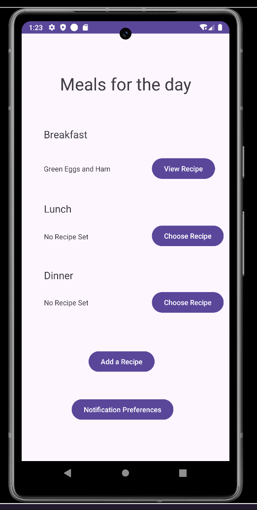
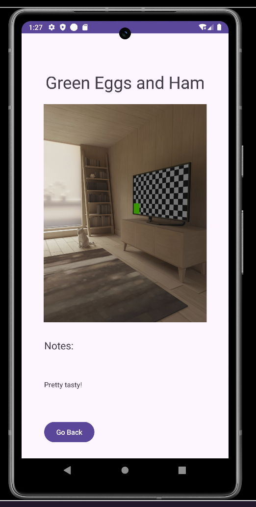

# Meal Planning (Android, Java)

Create recipes with a photo, assign them to Breakfast/Lunch/Dinner, and get notified at your chosen times.

## Features
- Create recipes with **title**, **notes**, and a **photo** (camera)
- Store recipes locally in **SQLite**
- Assign recipes to **Breakfast / Lunch / Dinner**
- Get **meal-time notifications** based on user-set times
- Change meal times in **Preferences** (stored with SharedPreferences)

## Architecture / Tech
- **Java**, XML layouts
- **SQLite** via custom `SQLiteOpenHelper` helpers:
  - `RecipeDBHelper` (recipes)
  - `MealDBHelper` (meal assignments)
- **RecyclerView** with `RecipeListAdapter`
- **Camera** via `MediaStore.ACTION_IMAGE_CAPTURE` + `FileProvider`
- **Notifications** with `AlarmManager` + `PendingIntent` → `MealService` posts a `Notification`
- **SharedPreferences** for `breakfast`, `lunch`, `dinner` times

## Screenshots

## How it works
- **Recipe**: `id`, `title`, `imagePath`, `notes`
- **Meal**: `id`, `recipeId`, `mealType` (`"breakfast" | "lunch" | "dinner"`), `date`
- **Preferences**: time strings `"HH:mm"` for each meal
- Choosing a recipe saves a `Meal` row and schedules an alarm that starts `MealService`, which posts a notification (“Meal Time!”).

## Getting Started
1. Open in **Android Studio**.
2. Sync Gradle.
3. Run on an emulator/device and grant **Camera** permission.
